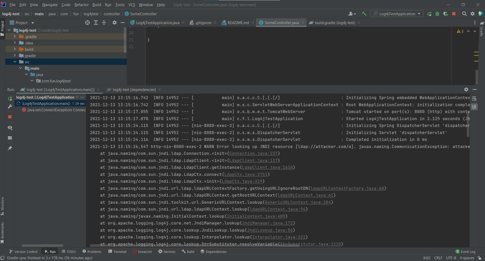

## Simple Example showing CVE-2021-44228 in action

### Explanation
* To reproduce this issue, I am removing the transitive dependency for logging from SpringBoot.
* Instead, I am bringing in `spring-boot-starter-log4j2`
* `spring-boot-starter-log4j2` brings in `log4j-core` which has the remote code exploit (RCE) vulnerability.

### Running API
* Either run the command `./gradlew clean build bootRun` in a terminal **OR**
* Right click and click `run` in `Log4TestApplication.java`.

### What happens when you pass in the JNDI value?
* Because we are resolving to a non-existent site, we get a `ConnectException`. 
* But, imagine the possibilities if this was an actual malicious server!

### Possible fix?
* Located in the `strategic-fix` branch of this project.
* The fix focuses on bringing in version `2.15.0` of `log4j-core` and `log4j-api` which resolves CVE-2021-44228.

### References:
* https://www.lunasec.io/docs/blog/log4j-zero-day/
* https://www.bleepingcomputer.com/news/security/new-zero-day-exploit-for-log4j-java-library-is-an-enterprise-nightmare/
* https://www.fastly.com/blog/digging-deeper-into-log4shell-0day-rce-exploit-found-in-log4j